**Source:** https://github.com/badriadhikari/AI-2020spring/tree/master/activities
**Tip**: When opening .ipynb files if you get **`Sorry,... Reload?`** error in Github, use **[https://nbviewer.jupyter.org/](https://nbviewer.jupyter.org/)**  

## 1. Python
* Watch how to use [Google Colab](https://www.youtube.com/watch?v=PVsS9WtwVB8)
* Practice Python3 - [notebook](../notebooks/python.ipynb) and watch [lecture](https://www.youtube.com/watch?v=V42qfAPybp8)
* If you are new to Python, I strongly suggest practicing Python at [codewars.org](https://www.codewars.com/)

## 2. Numpy, Matplotlib
* Practice Numpy - [notebook](../notebooks/numpy.ipynb) and [lecture](https://www.youtube.com/watch?v=Omz8P8n-5gY)
* Practice Matplotlib & Plotly - [notebook](../notebooks/matplotlib_plotly.ipynb) and [lecture](https://youtu.be/aIzkkjRzVdA)

## 3. Basic data analysis using Pandas
* Practice Pandas - [notebook](../notebooks/pandas.ipynb)
* Find a dataset of your choice at [kaggle.com](https://kaggle.com/) and repeat your analysis for the dataset you downloaded

## 4. Univariate linear regression (Chapter 18)
* Practice univariate linear regression - [notebook](../notebooks/Univariate_linear_regression.ipynb)
* Learn to normalize data - [notebook](../notebooks/normalization_techniques.ipynb)
* Find a dataset of your choice at [kaggle.com](https://kaggle.com/)
* From this dataset, select two variables (one input and one output) and perform univariate linear regression
  - Check that the variables you select are continuous

## 5. Linear regression with two input variables (Chapter 18)
* Practice linear regression with two input variables - [notebook](../notebooks/Linear_regression_2_inputs.ipynb)
* Find a dataset of your choice at Kaggle
* From this dataset, select three variables (two input and one output) and perform regression
  - Check that the variables you select are continuous

## 6. Logistic regression (Chapter 18)
* Practice logistic regression - [notebook](../notebooks/Logistic_regression.ipynb)
* Find a classification dataset of your choice at Kaggle
* From this dataset, select three variables (two input and one output) and perform regression
  - Check that the output variable is binary

## 7. Binary classification using NN
* Group discussion of "[A Visual and Interactive Guide to the Basics of Neural Networks](http://jalammar.github.io/visual-interactive-guide-basics-neural-networks/)"
* Practice binary classification - [notebook](../notebooks/Binary_classification.ipynb)
* Find a classification dataset of your choice at Kaggle
  - Check that the output variable is binary
  - Evaluate your model using accuracy, precision, and recall
  - Build a binary NN classifier for your dataset
  - Build a logistic regression model and observe the accuracy, i.e. compare the performance of the neural network with a logistic regression model
  - What is the baseline accuracy?

## 8. Breadth-first search (BFS) tree (Chapter 3)
1. Study and discuss the BFS algorithm.   
   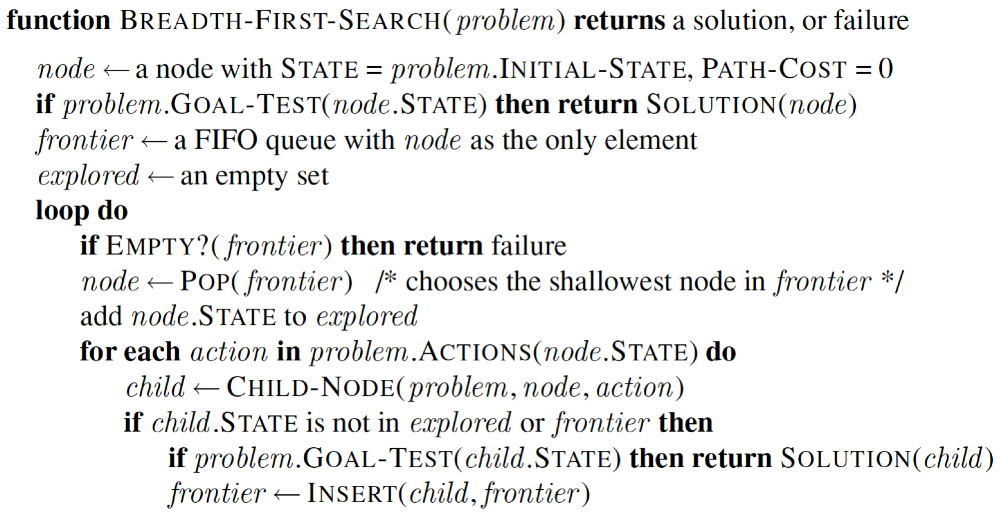
1. Study and discuss the BFS tree below.   
   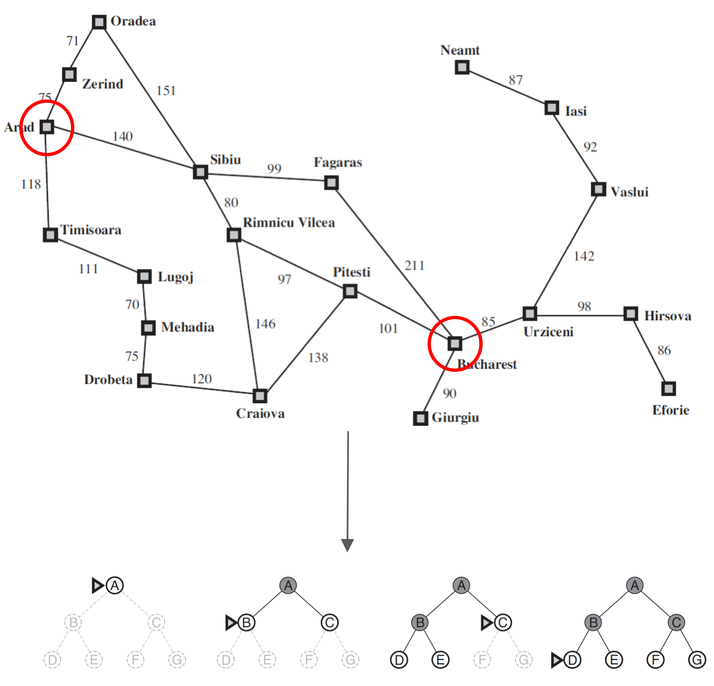
1. Here is a map of some international airports in India. Nick wants to go to Amritsar from Chennai (see the map). IN PAPER, draw a BFS tree for the graph of airport cities with starting node as Chennai (C).  
   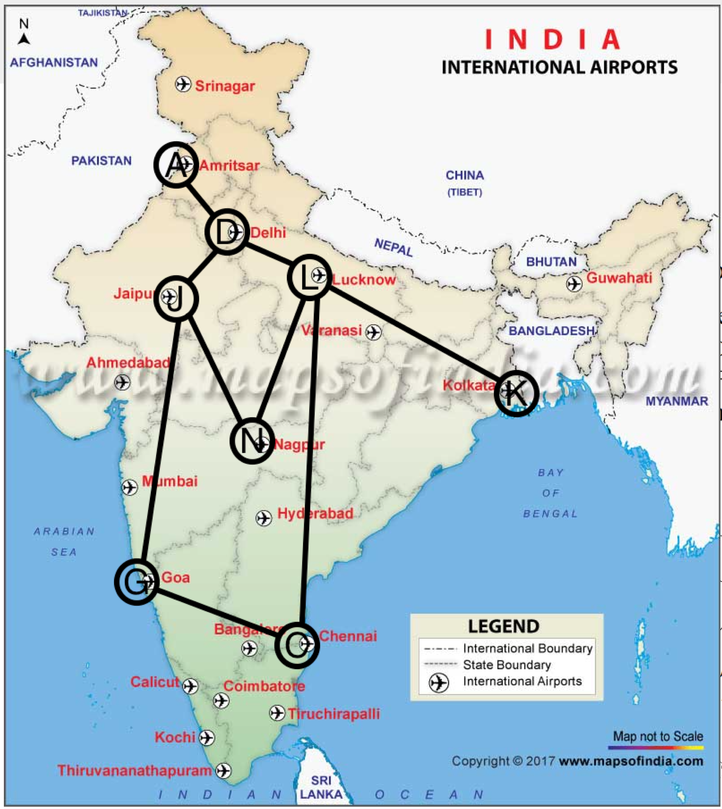

## 9. Implement the breadth-first search (BFS) algorithm (Chapter 3)
* Implement the BFS algorithm (in Python) to find the shortest path from Sibiu to Bucharest in this map.  
   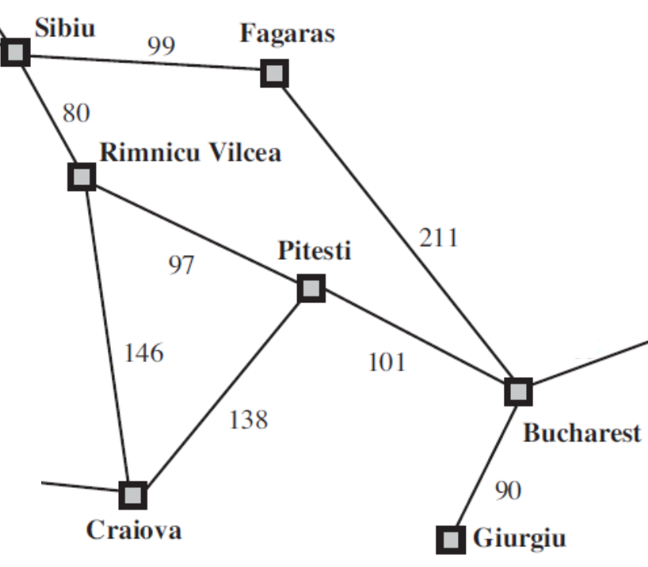   
* Queues in Python:
  ```Python
  # Initializing a queue 
  queue = []  
  # Adding elements to the queue 
  queue.append('a') 
  queue.append('b') 
  queue.append('c') 
  # Print
  print(queue) 
  # Removing elements from the queue 
  print("\nElements dequeued from queue") 
  print(queue.pop(0)) 
  print(queue.pop(0)) 
  print(queue) 
  ```
* Representing a graph using dictionary (values are lists of neighbors):
  ```
  graph = {} 
  graph['A'] = ['B', 'C']
  graph['B'] = ['A', 'D', 'E']
  ```

## 10. Regression using NN and evaluation
* Practice regression using neural networks - [notebook](../notebooks/Regression_NN.ipynb)
* Find a regression dataset of your choice at kaggle; make sure that the output variable is continuous real-valued
* On your new dataset, do the following:
  1. Train a regression neural neural network model
  1. Compare the MAE of your model with MAE of a linear regression model (only 1 layer)
  1. Is your model biased? i.e. in your true/prediction plot does your model predict smaller values more correctly or larger values more correctly?
  1. Which is the best loss function for your output variable? mae, mse, mean_squared_logarithmic_error, or logcosh?

## 11. Overfitting vs generalization
1. Find a dataset of your choice at Kaggle. Classification or regression, any.
1. Shuffle the rows
   ```python
   # Shuffle
   import random
   np.random.shuffle(dataset)
   ```
1. Split into training and validation set. For small datasets, ~30% works. For larger datasets, smaller percents can be enough.
   ```python
   # Index for 30%
   index_30percent = int(0.3 * len(dataset[:, 0]))
   print(index_30percent)
   # Split into training and validation
   XVALID = dataset[:index_30percent, "all input columns"]
   YVALID = dataset[:index_30percent, "output column"]
   XTRAIN = dataset[index_30percent:, "all input columns"]
   YTRAIN = dataset[index_30percent:, "output column"]
   ```
    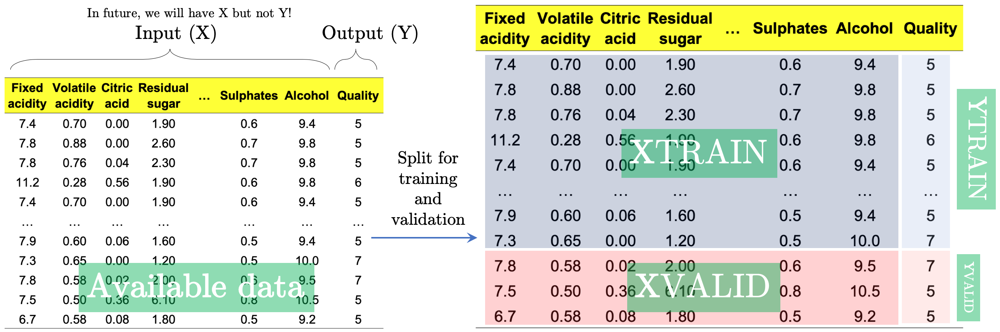
1. If you are normalizing your data, only use the XTRAIN and YTRAIN to obtain the normalization parameters (mean/std). Do not use XVALID or YVALID.
1. Build a NN model to overfit the training set (to get ~100% accuracy or ~0.0 MAE) and then evalute on the validation set and observe the accuracy/MAE
   1. Learn the model from training set
      ```python
      model.fit(XTRAIN, YTRAIN, ...)
      ```
   1. Evaluate on XTRAIN
      ```python
      P = model.predict(XVALID)
      MAE = abs(YTRAIN - P)
      ```
   1. Normalize XVALID and YVALID using the mean/std/Ymax obtained from XTRAIN/YTRAIN
   1. Predict for validation set and evaluate
      ```
      P = model.predict(XVALID)
      MAE = abs(YVALID - P)
      ```
   1. Plot true vs prediction plots for sets (training and validation) and compare the plots
1. Answer the following questions:
   1. Does your model perform better on the training set or validation set? Is this a problem? How to avoid this problem?
   1. Why can over-training be a problem?
   1. What is "generalization"?
   1. What is over-fitting?
   1. Why should you not use XVALID/YVALID during normalization?

## 12. Alpha-beta pruning (Chapter 5)
* This is not a programming activity, you will solve it in paper.
* For the following game tree, (a)show which nodes/sub-tree will be pruned by the Alpha-Beta pruning algorithm, and (b) calculate the minimax values (the output of MAX-VALUE or MIN-VALUE) for the non-leaf nodes. 
  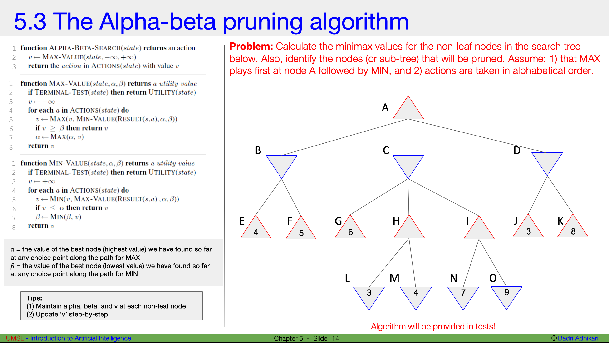
 
## 13. Learning curves
1. Read [this](https://machinelearningmastery.com/learning-curves-for-diagnosing-machine-learning-model-performance/) blog about learning curves.
1. Find a dataset of your choice (regression or classification) at Kaggle. Shuffle it, split it, and train a model.
1. Obtain learning curves for your dataset
   ```python
   # Do the training (specify the validation set as well)
   history = model.fit(XTRAIN, YTRAIN, validation_data=(XVALID, YVALID), ...)
   # Check what's in the history
   print(history.params)
   # Plot the learning curves (loss/accuracy/MAE)
   plt.plot(history.history['loss']) # replace with accuracy/MAE
   plt.plot(history.history['val_accuracy']) # replace with val_accuracy, etc.
   plt.ylabel('Accuracy')
   plt.xlabel('epoch')
   plt.legend(['training data', 'validation data'], loc='lower right')
   plt.show()
   ```
1. Using your dataset, produce the learning curves that represent the following cases:
   1. too small validation dataset (relative to training set)
   1. too small training set (relative to validation set)
   1. a good learning curve (practically good)
   1. an overfitting model
   1. a model that clearly requires further training
   1. an underfit model that does not have sufficient capacity (also may imply that the data itself is difficult)
1. Interpret the following learning curve:   
   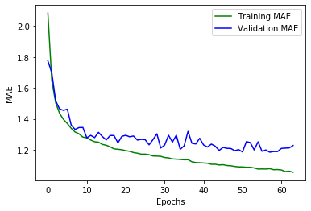

## 14. Fine-tuning hyper-parameters of your model
* Find a dataset of your choice at Kaggle
  * It can your project dataset
* Split into training and validation set
* Your goal is to find the optimal hyper-parameters that maximize the accuracy (or minimize MAE) on the validation set
  You can try the following:
  * Increase the number of layers
  * Increasing the number of neurons in each layer
  * Study how the number of layers and number of neurons in each layer affect the model's performance on validation set
* Verify that the number of parameters in your model is optimal
  * Show that two different models with slightly smaller parameters do not perform as good
  * Show that two different models with slightly larger parameters do not perform as good
* Why are the parameters such as #of neurons, #of layers, #of epochs, batch size, activation functions, etc. call hyper-parameters and not just parameters?

## 15. Implement BM25 function (Chapter 22)
* The objective in this activity is to search for 'relevant' document/s in a document corpus (database) by implementing the BM25 scoring function. [This 15 minute youtube video](https://www.youtube.com/watch?v=a3sg6MH8m4k&t=7s) may be helpful to review the basic idea of the BM25 scoring function.
  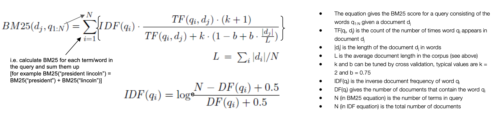
* Task: A search query “Word1 Word2” is being scored against 40 documents. The number of times the words “Word1” and “Word2” appear in each of the documents is given in the [table](./bm25.csv). Write a Python program to calculate the BM25 score for the query against all the documents and rank the documents by their BM25 score. You will need to compute IDF, DF, TF, N, L, etc. by reading the table. Assume k = 1.2 and b = 0.75.  
* Structure for the solution:
  ```python
  # Step 1: for loops to calculate IDF for Word1 and Word2
  ...
  # Step 2: for loop to calculate L
  ...
  # Step 3: create a dictionary/list to maintain BM25 for each document
  bm25 = {}
  # Step 4: for loop to calculate BM25 for each document
  for each ...:
    bm25[doci] = ...
  # Step 5: display documents sorted by score 
  ...
  ```

## 16. Implement PageRank algorithm (Chapter 22)
* The objective in this activity is to implement a basic version of the PageRank algorithm - a core algorithm originally developed by Google for ranking pages. [This 12 minute youtube](https://youtu.be/CsvyPNdQAHg) video explains the basic idea. Here is the expression for the original version of the PageRank algorithm.  
  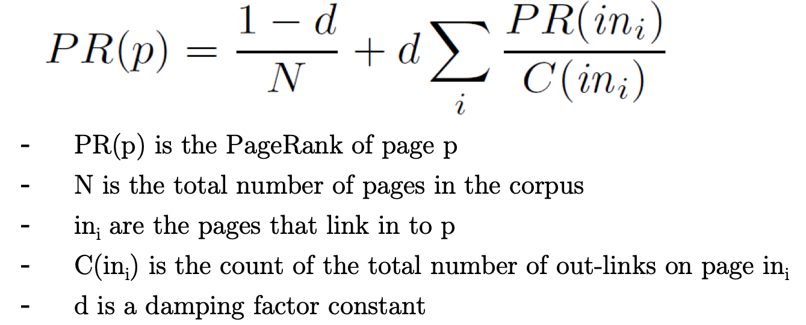
* Task: For the network shown below, calculate the PageRank of the pages A, B, and C, and D by writing a Python program to iteratively obtain the final page ranks. Assume that the damping parameter d is 0.7.   
  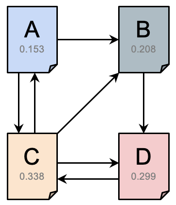  
* Structure for the solution:
  ```python
  # Step1. Initialize the constants N and d
  # Step2. Assume that all page ranks are 1.0 at the beginning
  prA = 1.0
  ...
  # Step3. In a for/while loop, iteratively update the page ranks of all the pages
  for (many times):
     prA = "expression for prA"
     ...
  # Step4. Print the page ranks
  ```

## 17. Early stopping
* Find a dataset of your choice at Kaggle (it can your project dataset) and split into training and validation set
* Assumption: You already know (tentatively) what hyperparameters are good for your dataset
* There are two objectives in this activity:  
  a. Implement automatic stopping of training if the accuracy does not improve for certain epochs  
  b. Implement automatic saving of the best model (best on the validation set)  
* Define callbacks as follows (and fix the obvious bugs):
  ```python
  from tensorflow.keras.callbacks import EarlyStopping, ModelCheckpoint
  # File name must be in quotes
  callback_a = ModelCheckpoint(filepath = your_model.hdf5, monitor='val_loss', save_best_only = True, save_weights_only = True, verbose = 1)
  # The patience value can be 10, 20, 100, etc. depending on when your model starts to overfit
  callback_b = EarlyStopping(monitor='val_loss', mode='min', patience=your_patience_value, verbose=1)
  ```
* Update your `model.fit()` by adding the callbacks:
  ```python
  history = model.fit(XTRAIN, YTRAIN, validation_data=(XVALID, YVALID), epochs=?, batch_size=?, callbacks = [callback_a, callback_b])
  ```
* Before you evaluate your model on the validation set, it is important to load the "checkpoint-ed" model:
  ```python
  # File name must be in quotes
  model.load_weights(your_model.hdf5)
  ```
* Plot the learning curves and demonstrate that model checkpointing helps to obtain higher accuracy on the validation set
  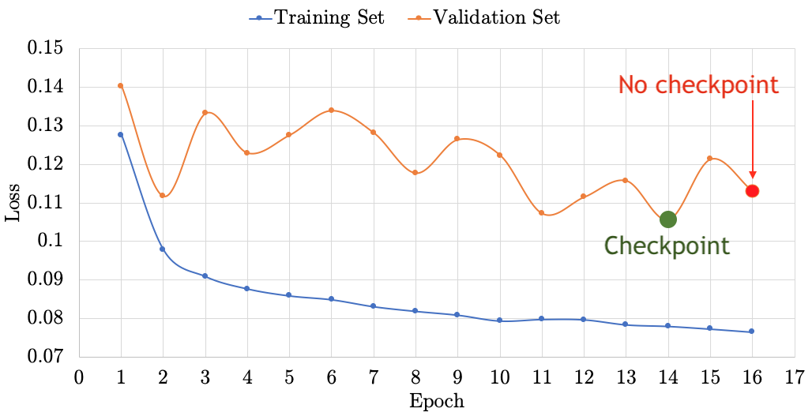
* At the end of your notebook, answer the following questions:  
  a. Almost always, training with early stopping finishes faster (because it stops early). Approximately, how long does it take for your training to finish with and without early stopping?  
  b. When model checkpointing, your checkpointed model will almost always be more accurate on the validation set. What is the accuracy/MAE on the Validation set with and without model checkpointing?

## 18. Implement convolution operation (Chapter 24)
* In this activity you will implement the convolution operation. Your implementation will serve as an image edge detector.
* Resources:
   * Read what convolution is (just the first four paragraphs) under the section "2D Convolutions: The Operation" at [this](https://towardsdatascience.com/intuitively-understanding-convolutions-for-deep-learning-1f6f42faee1) link
   * Watch this [17 minute youtube](https://www.youtube.com/watch?v=mjh5NIn1yHk) lecture
* Upload `my-cat.csv` to your Colab
* Complete the `convolution2D()` function in the code below. Hint: You will need to multiply each input pixel (3x3 neighbor grid) of the input 2D array `image2D` with the input filter `kernel3x3` to obtain the output 2D array `convolved2D`.

    ```python
    import seaborn as sns
    import matplotlib.pyplot as plt
    import numpy as np
        
    def convolution2D(image2D, kernel3x3):
        convolved2D = np.zeros((len(image2D)-2, len(image2D)-2))
        # ToDo: Write your code here...

        return convolved2D

    image2D = np.loadtxt('my-cat.csv', delimiter=',')
    sns.heatmap(image2D, cmap='gray')
    plt.title('Original image - Size = ' + str(image2D.shape))
    plt.show()

    edge_detect_filter_3x3 = np.array([[-1, -1, -1], [-1, 8, -1], [-1, -1, -1]])

    for i in range(2):
        convolved_image = convolution2D(image2D, edge_detect_filter_3x3)
        sns.heatmap(convolved_image, cmap='gray')
        plt.title('Convolution iteration ' + str(i) + ' - Size = ' + str(convolved_image.shape))
        plt.show()
        image2D = convolved_image
    ```
* Expected output:
  

## 19. Iterative feature removal & selection
* As of now, it is assumed that given a dataset (of your choice) you can build a model that can do reasonably well on the validation set, i.e. you have a good idea of the network architecture needed, the number of epochs needed, model Checkpointing, the approximate MAE or accuracy that one might expect, etc.
* Here we will train a model using the training set and evaluate on the validation set; you are free to choose your own dataset (even your project dataset is fine)
* In this activity you will implement a simple Recursive Feature Elimination (RFE) technique to remove redundant or insignificant input features
* Expected output 1: Plot the significance (importance) of each feature after training your model using one feature at a time:   
   a. X-axis represents the feature that was used as the input  
   b. Y-axis is accuracy or MAE of the validation set  
   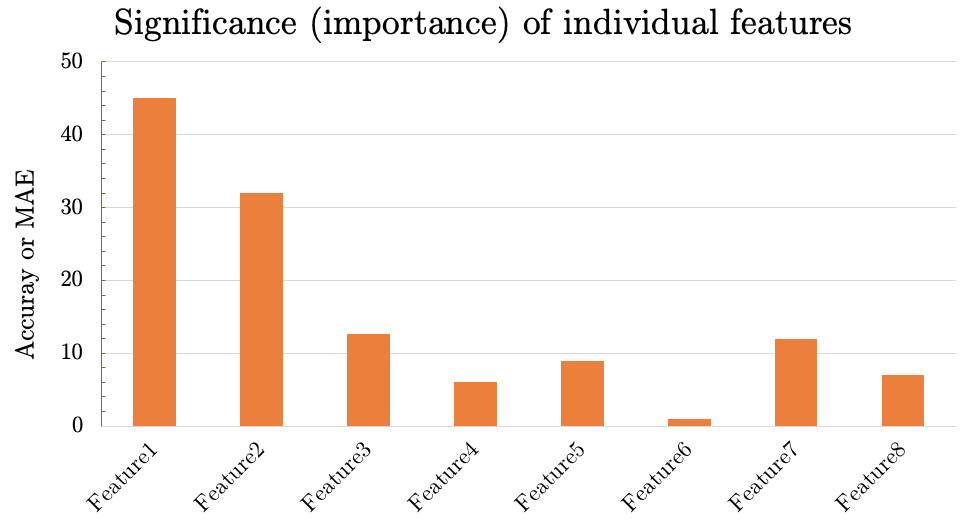
* Observing these MAE/accuracy values, we can rank the features by their importance (how informative each one is)
* Next, iteratively remove one feature at a time (starting with the least significant feature) and repeat the training noting the accuracy/MAE on the validation set
* Expected output 2: Plot to report your findings:   
   a. X-axis represents feature removal, for example, second entry is after removing feature1, and third entry is after removing feature1 and feature2  
   b. Y-axis is accuracy or MAE of the validation set  
   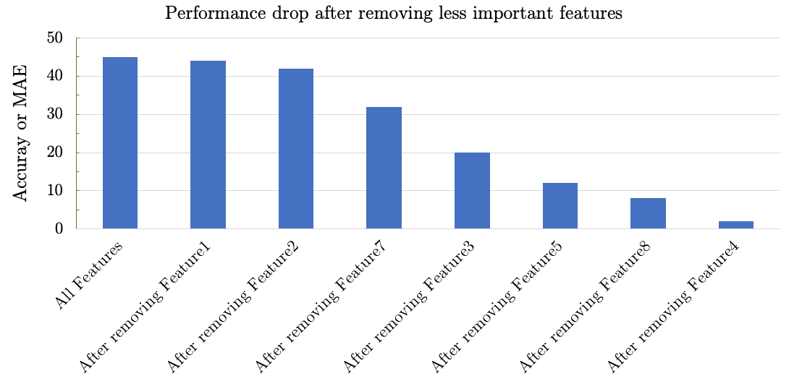  

## 20. Binary classification and regression using XGBoost
* The goal here is to study how the XGBoost library can be used for building boosted decision trees for classification and regression   
   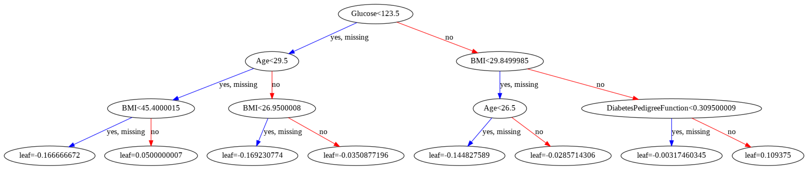  
* Task 1: Binary classification using XGBoost
   1. Study how the xgboost library can be used for binary classification - [notebook](../notebooks/XGBoost_for_classification.ipynb)
   1. For a dataset of your choice, build an `XGBClassifier()` model to obtain higest possible accuracy on the validation set (by adapting the hyperparameters of the model such as `n_estimators` and `max_depth`)
   1. Visualize at least one decision tree and write a few sentences interpreting the decision tree
   1. Compare the accuracy/precision of this model with a neural network model
   1. Expected output: A notebook that has answers for all the four tasks above **(on a different dataset)**

* Task 2: Regression using XGBoost
   1. Study how the xgboost library can be used for regression - [notebook](../notebooks/XGBoost_for_regression.ipynb)
   1. For a dataset of your choice, build an `XGBRegressor()` model to obtain lowest possible MAE on the validation set (by adapting the hyperparameters of the model such as `n_estimators` and `max_depth`)
   1. Visualize at least one decision tree and write a few sentences interpreting the decision tree
   1. Compare the MAE of this model with a neural network model
   1. Expected output: A notebook that has answers for all the four tasks above **(on a different dataset)**

## 21. Feature importance and removal using XGBoost
* In this activity, you will study feature importance using the XGBoost library
* After building your XGBoost model (classifier or regressor) studying feature importance is just one line of code
   ```python
   from xgboost import plot_importance
   plt.rcParams['figure.figsize'] = [8, 4]
   plot_importance(xg_cla)
   ```
   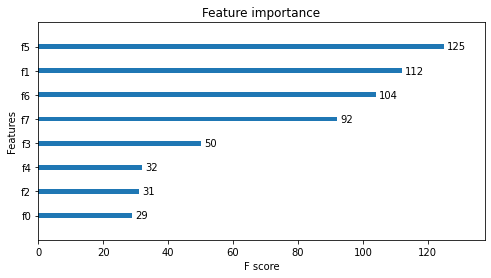  
* Expected outputs:
   1. Plot feature importance for a dataset of your choice and briefly discuss if the findings are similar or different from your intuition (i.e. why does the feature importance makes sense?)
   1. Iteratively remove one feature at a time (starting with the least significant feature) and repeat the training noting the accuracy/MAE on the validation set and plot to report your findings (X-axis represents feature removal, for example, second entry is after removing feature1, and third entry is after removing feature1 and feature2, etc.)
   1. Discuss how your findings relate to your feature importance and reduction study using neural networks

## 22. Peer-review of reports
* Review the reports of the first three phases of the project of a peer in the class

## 23. Learning with missing values & noisy data
* In this activity, we will investigate the impact of "amount of data" and missing/noisy data
* For a dataset of your choice, randomly set random rows/columns (around 10% of your total rows) to non-standard values such as -9999 or 9999 and repeat your training/evaluation.
  * Expected output: Your discussion of how noisy data impacts the accuracy/MAE on the validation set
  ```python
  # Sample code to make data noisy
  import numpy as np
  dataset = np.loadtxt('winequality-red.csv', delimiter=",", skiprows=1)
  for i in range(100):
      # Choose a random row
      rand_row = random.randint(0, len(dataset) - 1)
      # Choose a random column (except the last/output column)
      rand_col = random.randint(0, len(dataset[0, :]) - 2)
      print(rand_row, rand_col)
      # Set the row and column to -9999 or 9999
      dataset[rand_row, rand_col] = 9999
  ```
* For a dataset of your choice, iteratively decrease the total number of data (rows) and and evaluate the accuracy/MAE on the validation set - please do not change the validation set (keep the same number of rows in each run); only decrease the number of rows in the training set.
  * Expected output: A plot showing how the # of rows (x-axis) impacts the accuracy/MAE on validation data (y-axis) - with at least 8/10 points on the plot (for example: 1%, 2%, 5%, 10%, 20%, 40%, 60%, and 80%)

## 24. Cross-validation
* In this activity, we will study cross-validation   
   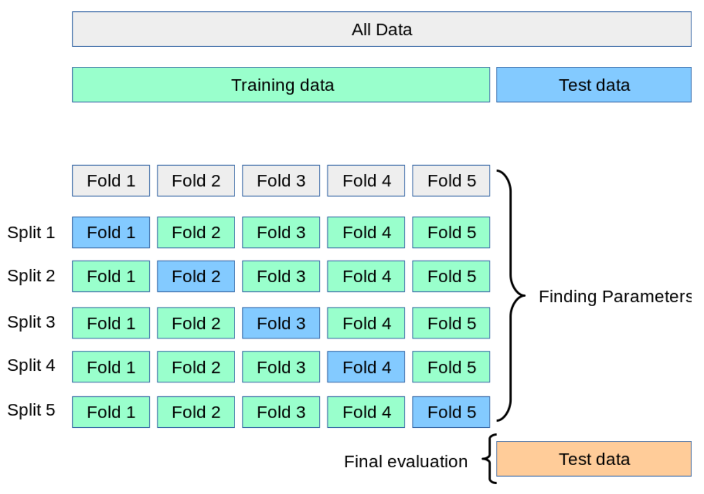  
* Here is a sample Python code:
   ```python
   # Say our data has 100 rows and 12 columns - last column is the output column 
   print(dataset.shape)
   X = dataset[ : , :-1]
   Y = dataset[ : , -1]
   ```
   
   ```
   (100, 12)
   ```

   ```python
   from sklearn.model_selection import KFold
   # Define 5 folds
   kf = KFold(n_splits = 5)
   # Returns the number of splitting iterations in the cross-validator
   kf.get_n_splits(X)
   print(kf)
   ```
   
   ```
   KFold(n_splits=5, random_state=None, shuffle=False)
   ```
   
   ```python
   split = 0
   for train_indices, valid_indices in kf.split(X):
       print('')
       split += 1
       print('Split:', split)
       print('TRAIN:')
       print(train_indices.shape)
       print(train_indices) 
       print('VALID:')
       print(valid_indices.shape)
       print(valid_indices)
       XTRAIN, XVALID = X[train_indices], X[valid_indices]
       YTRAIN, YVALID = Y[train_indices], Y[valid_indices] 
       # Your code for training/evaluation goes here..
       # ToDo..

   ```

   ```
   Split: 1
   TRAIN:    
   (80,)    
   [20 21 22 23 24 25 26 27 28 29 30 31 32 33 34 35 36 37 38 39 40 41 42 43   
     44 45 46 47 48 49 50 51 52 53 54 55 56 57 58 59 60 61 62 63 64 65 66 67   
     68 69 70 71 72 73 74 75 76 77 78 79 80 81 82 83 84 85 86 87 88 89 90 91   
     92 93 94 95 96 97 98 99]    
   VALID:   
   (20,)   
   [ 0  1  2  3  4  5  6  7  8  9 10 11 12 13 14 15 16 17 18 19]
   ```
* Expected output: Create a table summarizing your accuracy/MAE in each split; here is a sample table:   

   | Split | Accuracy/MAE |
   |---|---| 
   | 1  | ?  |
   | 2  |  ? |
   | ...  | ... |
